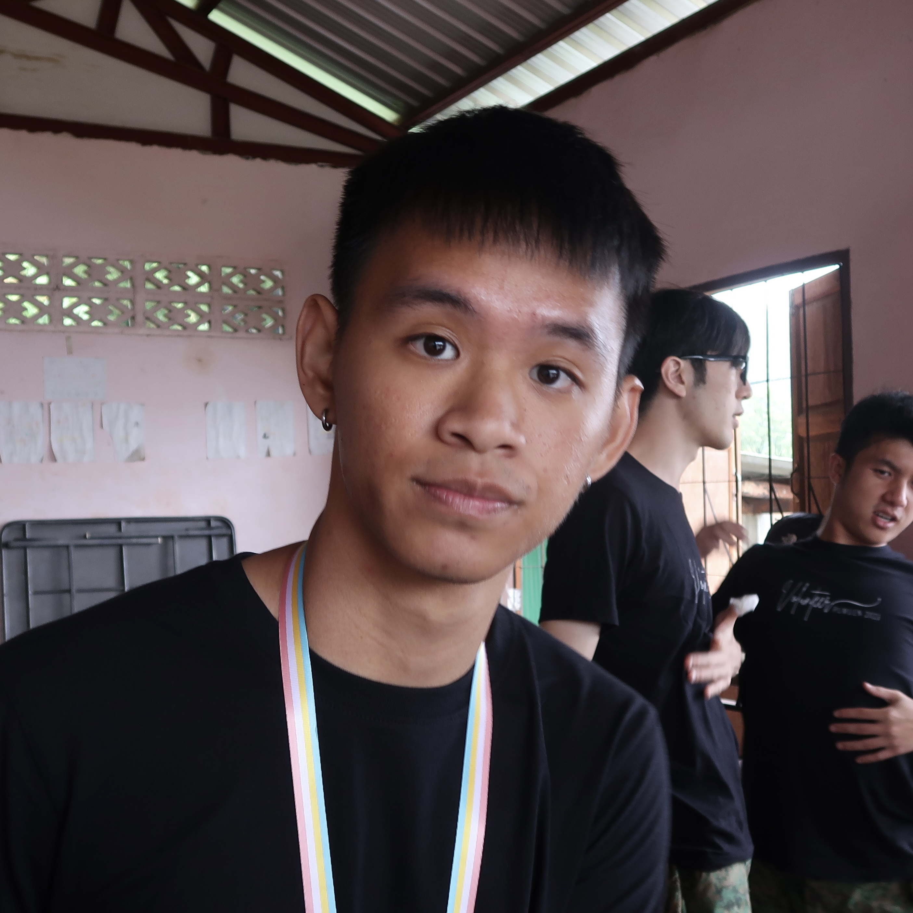
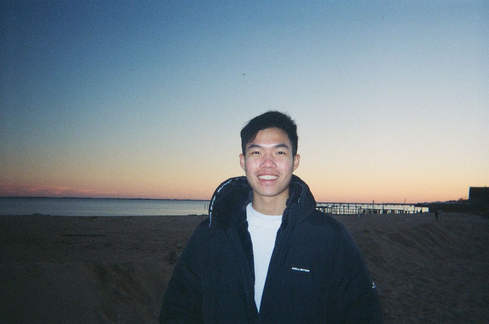

We are a team based in the [School of Computing, National University of Singapore](http://www.comp.nus.edu.sg).

You can reach us at the email `friendbook@u.nus.edu.sg`

## Project team

### Elijah Chia

[[github](https://github.com/Elijah5399)]
[[portfolio](team/elijah5399.md)]

* Role: Developer
* Responsibilities: Frontend and Backend Development

### Jannice Suciptono

[[github](https://github.com/jannnice)]
[[portfolio](team/jannnice.md)]

* Role: Developer
* Responsibilities: Frontend and Backend Development

### Goh Teng Fong

[[github](http://github.com/GohTengFong)]
[[portfolio](team/gohtengfong.md)]

* Role: Developer
* Responsibilities: Backend Development + Dev Ops

### Ho Hong Wei

[[github](http://github.com/redtailedfox)]
[[portfolio](team/redtailedfox.md)]

* Role: Developer
* Responsibilities: Backend Development + Data

### Victor Lai

[[github](https://github.com/victorlaiyeeteng)]
[[portfolio](team/victorlaiyeeteng.md)]

* Role: Developer
* Responsibilities: Backend Development + Dev Ops
