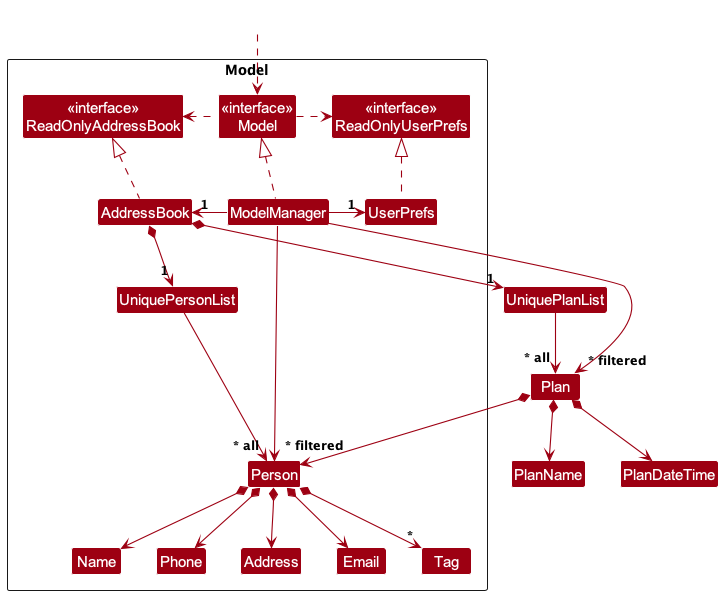
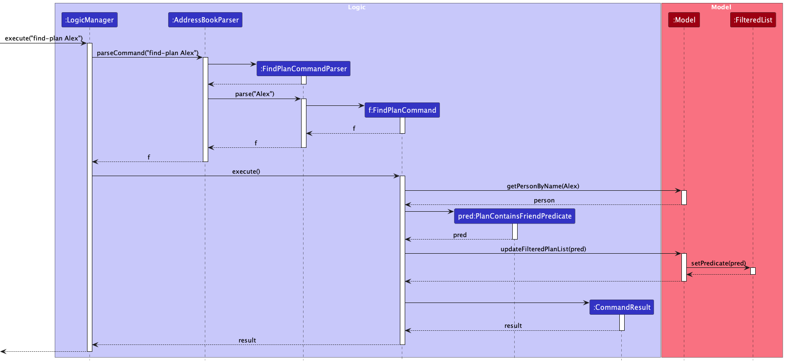
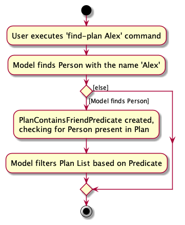
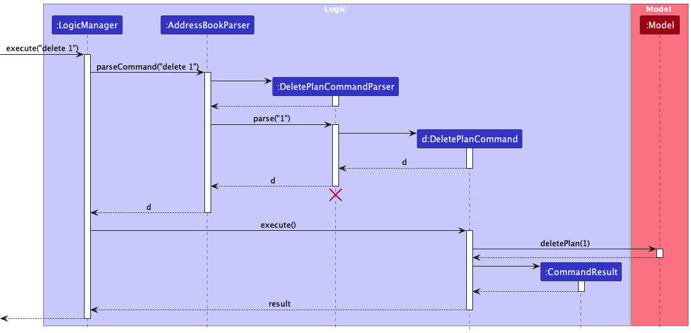
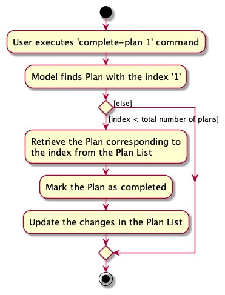

* Table of Contents
{:toc}

--------------------------------------------------------------------------------------------------------------------

## **Acknowledgements**

* {list here sources of all reused/adapted ideas, code, documentation, and third-party libraries -- include links to the original source as well}

--------------------------------------------------------------------------------------------------------------------

## **Setting up, getting started**

Refer to the guide [_Setting up and getting started_](SettingUp.md).

--------------------------------------------------------------------------------------------------------------------

## **Design**

:bulb: **Tip:** The `.puml` files used to create diagrams in this document `docs/diagrams` folder. Refer to the [_PlantUML Tutorial_ at se-edu/guides](https://se-education.org/guides/tutorials/plantUml.html) to learn how to create and edit diagrams.

### Architecture

The ***Architecture Diagram*** given above explains the high-level design of the App.

Given below is a quick overview of main components and how they interact with each other.

**Main components of the architecture**

**`Main`** (consisting of classes [`Main`](https://github.com/se-edu/addressbook-level3/tree/master/src/main/java/seedu/address/Main.java) and [`MainApp`](https://github.com/se-edu/addressbook-level3/tree/master/src/main/java/seedu/address/MainApp.java)) is in charge of the app launch and shut down.
* At app launch, it initializes the other components in the correct sequence, and connects them up with each other.
* At shut down, it shuts down the other components and invokes cleanup methods where necessary.

The bulk of the app's work is done by the following four components:

* [**`UI`**](#ui-component): The UI of the App.
* [**`Logic`**](#logic-component): The command executor.
* [**`Model`**](#model-component): Holds the data of the App in memory.
* [**`Storage`**](#storage-component): Reads data from, and writes data to, the hard disk.

[**`Commons`**](#common-classes) represents a collection of classes used by multiple other components.

**How the architecture components interact with each other**

The *Sequence Diagram* below shows how the components interact with each other for the scenario where the user issues the command `delete 1`.

Each of the four main components (also shown in the diagram above),

* defines its *API* in an `interface` with the same name as the Component.
* implements its functionality using a concrete `{Component Name}Manager` class (which follows the corresponding API `interface` mentioned in the previous point.

For example, the `Logic` component defines its API in the `Logic.java` interface and implements its functionality using the `LogicManager.java` class which follows the `Logic` interface. Other components interact with a given component through its interface rather than the concrete class (reason: to prevent outside component's being coupled to the implementation of a component), as illustrated in the (partial) class diagram below.

The sections below give more details of each component.

### UI component

The **API** of this component is specified in [`Ui.java`](https://github.com/se-edu/addressbook-level3/tree/master/src/main/java/seedu/address/ui/Ui.java)
<!-- TODO: Add Plan-related UI stuff into the diagram -->

The UI consists of a `MainWindow` that is made up of parts e.g.`CommandBox`, `ResultDisplay`, `PersonListPanel`, `StatusBarFooter` etc. All these, including the `MainWindow`, inherit from the abstract `UiPart` class which captures the commonalities between classes that represent parts of the visible GUI.

The `UI` component uses the JavaFx UI framework. The layout of these UI parts are defined in matching `.fxml` files that are in the `src/main/resources/view` folder. For example, the layout of the [`MainWindow`](https://github.com/se-edu/addressbook-level3/tree/master/src/main/java/seedu/address/ui/MainWindow.java) is specified in [`MainWindow.fxml`](https://github.com/se-edu/addressbook-level3/tree/master/src/main/resources/view/MainWindow.fxml)

The `UI` component,

* executes user commands using the `Logic` component.
* listens for changes to `Model` data so that the UI can be updated with the modified data.
* keeps a reference to the `Logic` component, because the `UI` relies on the `Logic` to execute commands.
* depends on some classes in the `Model` component, as it displays `Person` object residing in the `Model`.

### Logic component

**API** : [`Logic.java`](https://github.com/se-edu/addressbook-level3/tree/master/src/main/java/seedu/address/logic/Logic.java)

Here's a (partial) class diagram of the `Logic` component:

The sequence diagram below illustrates the interactions within the `Logic` component, taking `execute("delete 1")` API call as an example.

:information_source: **Note:** The lifeline for `DeleteCommandParser` should end at the destroy marker (X) but due to a limitation of PlantUML, the lifeline reaches the end of diagram.

How the `Logic` component works:

1. When `Logic` is called upon to execute a command, it is passed to an `AddressBookParser` object which in turn creates a parser that matches the command (e.g., `DeleteCommandParser`) and uses it to parse the command.
1. This results in a `Command` object (more precisely, an object of one of its subclasses e.g., `DeleteCommand`) which is executed by the `LogicManager`.
1. The command can communicate with the `Model` when it is executed (e.g. to delete a person).
1. The result of the command execution is encapsulated as a `CommandResult` object which is returned back from `Logic`.

Here are the other classes in `Logic` (omitted from the class diagram above) that are used for parsing a user command:

How the parsing works:
* When called upon to parse a user command, the `AddressBookParser` class creates an `XYZCommandParser` (`XYZ` is a placeholder for the specific command name e.g., `AddCommandParser`) which uses the other classes shown above to parse the user command and create a `XYZCommand` object (e.g., `AddCommand`) which the `AddressBookParser` returns back as a `Command` object.
* All `XYZCommandParser` classes (e.g., `AddCommandParser`, `DeleteCommandParser`, ...) inherit from the `Parser` interface so that they can be treated similarly where possible e.g, during testing.

### Model component
**API** : [`Model.java`](https://github.com/se-edu/addressbook-level3/tree/master/src/main/java/seedu/address/model/Model.java)

The `Model` component,

* stores the address book data i.e., all `Person` and `Plan` objects (which are contained in `UniquePersonList` and `UniquePlanList` objects).
* stores the currently 'selected' `Person` and `Plan` objects (e.g., results of a search query) as separate _filtered_ lists which are exposed to outsiders as unmodifiable `ObservableList<Person>` and `ObservableList<Plan>` that can be 'observed' e.g. the UI can be bound to this list so that the UI automatically updates when the data in the list change.
* stores a `UserPref` object that represents the user’s preferences. This is exposed to the outside as a `ReadOnlyUserPref` objects.
* does not depend on any of the other three components (as the `Model` represents data entities of the domain, they should make sense on their own without depending on other components)

:information_source: **Note:** An alternative (arguably, a more OOP) model is given below. It has a `Tag` list in the `AddressBook`, which `Person` references. This allows `AddressBook` to only require one `Tag` object per unique tag, instead of each `Person` needing their own `Tag` objects. 

### Storage component

**API** : [`Storage.java`](https://github.com/se-edu/addressbook-level3/tree/master/src/main/java/seedu/address/storage/Storage.java)

The `Storage` component,
* can save both address book data and user preference data in JSON format, and read them back into corresponding objects.
* inherits from both `AddressBookStorage` and `UserPrefStorage`, which means it can be treated as either one (if only the functionality of only one is needed).
* depends on some classes in the `Model` component (because the `Storage` component's job is to save/retrieve objects that belong to the `Model`)

### Common classes

Classes used by multiple components are in the `seedu.addressbook.commons` package.

--------------------------------------------------------------------------------------------------------------------

## **Implementation**

This section describes some noteworthy details on how certain features are implemented.

### _New features added to AddressBook_

<<<<<<< HEAD
### 1. `add-plan`
=======
### 1. `add-plan` 
>>>>>>> 31b2e86794be09e116667d81938d899a8c96242a

The add-plan command allows users to add a new Plan, provided that it involves a friend who is present in `UniquePersonList` and the Plan does not already exist.

Add-plan is done similarly to the original add command in AddressBook.

The `add-plan` command is executed by the `Logic`, then parsed by the AddressBookParser. It then creates a `AddPlanCommandParser`. This is then used to parse the command. This results in a `AddPlanCommand` object. The `.execute()` method of the `AddPlanCommand` object is then invoked by `Logic`. Following this, `AddPlanCommand` then communicates with `Model`. It first uses the `Model::getPersonByName` function to check if that friend exists. If the friend exists, a `Plan` object is created, and `Model` helps to add it. Finally, a `CommandResult` is returned.

Note that there are several classes not included in the above diagram, but still used. These include (but are not limited to) the `AddressBook` class which stores `UniquePersonList` and `UniquePlanList`. A `Plan` object also requires `PlanName`, `PlanDateTime` and a `Person` object as the friend associated with the Plan.

### 2. `find-plan`

The `find-plan` command allows the user to find all plans associated with a saved friend. The plans list on the
Ui will be updated to display the relevant plans. This mechanism is facilitated by the `Model` interface through 
has the following operations:
* `Model#getPersonByName(Name)` - Gets the friend (Person object) by Name input.
* `Model#updateFilteredPlanList(Predicate)` - Filters the list of plans to display by the Predicate input.

Given below is an example usage scenario and how the find plan mechanism behaves at each step.

Step 1. The user has friends and some plans associated to the friends. The `Model` will store the list of plans in the
form of a `FilteredList` type.

Step 2. The user executes `find-plan Alex` command to find all plans associated with `Alex` saved in the FriendBook. 
As described in the Logic Component above, this will create a `FindPlanCommand` instance. 

Step 3. The `LogicManager` will call `FindPlanCommand#execute()` to start the search for plans. Then, `Model#getPersonByName(Name)`
will be called to find the friend with the given Name, returning a `Person` instance.

:information_source: **Note:** If no friends can be found in the address book with the given Name, an error will be thrown and the mechanism will terminate.

Step 4. `FindPlanCommand#execute()` then creates a `PlanContainsFriendPredicate` instance that checks if a `Plan` composes of the `Person` instance returned in step 3.

Step 5. Finally, this `Predicate` instance will be inputted into the `Model#updateFilteredPlanList(Predicate)` method to filter for the `Plan` objects that satisfy the 
`Predicate` from step 4. This will allow the Ui to display the filtered plans, representing the plans associated with the given name (unique to a Person object).

The following sequence diagram shows how the `find-plan` command works.

The following activity diagram summarizes what happens when a user executes the `find-plan` command:

#### Design considerations:

**Aspect: What `find-plan` command takes in:**

* **Alternative 1 (current choice):** Friend's Full Name
    * Pros: Guaranteed to find a unique friend (if saved in FriendBook).
    * Cons: User may find difficulty remembering the full name, or face typo issues.

* **Alternative 2:** Friend's First Name
  itself.
    * Pros: Will be more convenient for the user to query.
    * Cons: Implementation of finding by First Name is more challenging, and there may be duplicate friends with the same First Name, 
  since each Person object's First Name does not have to be unique.

### 3. `delete-plan`

The `delete-plan` command allows the user to delete a plan. The plans list on the
Ui will be updated to display the relevant plans. This mechanism is facilitated by the `Model` interface through
has the following operations:
* `Model#deletePlan(Plan)` - Gets the plan (Plan object) by Plan input.

Given below is an example usage scenario and how the find plan mechanism behaves at each step.

Step 1. The user has plans. The `Model` will store the list of plans in the
form of a `FilteredList` type.

Step 2. The user executes `delete-plan index` command to find plan at that index in the FriendBook.
As described in the Logic Component above, this will create a `DeletePlanCommand` instance.

Step 3. The `LogicManager` will call `DeletePlanCommand#execute()` to start the search for plans. Then, `Model#deletePlan(Plan)`
will be called to delete that plan.

Step 4. `Model#deletePlan(Plan)` will call `AddressBook#removePlan(Plan)` which will then remove the plan from the UniquePlanList in the FriendBook.

Step 5. The Ui will display a success message if the command is successful and the error message otherwise.
 

:information_source: **Note:** If no plan can be found in the address book with the given index, an error will be thrown and the mechanism will terminate.

### 4. `edit-plan` [possible]

Edit plan is done similarly to the original edit command in AddressBook.
<!-- Insert sequence diagram here -->
The `edit-plan` command is executed by the `Logic`, then parsed by the AddressBookParser. It then creates a `EditPlanCommandParser`. This is then used to parse the command. This results in a `EditPlanCommand` object. The `.execute()` method of the `EditPlanCommand` object is then invoked by `Logic`. The command then communicates with `Model` when it is executed.
<!-- Add more details rgd the communication here -->

### 5. `complete-plan`

The `complete-plan` command allows the users to mark their plans as completed. 
The Plan status will then be updated accordingly in the Ui. This mechanism is facilitated by the `Model` interface through
has the following operations:
* `Model#getFilteredPlanList()` - Gets the list of Plans.
* `Model#completePlan(Plan)` - Marks the Plan as completed.
* `Model#updateFilteredPlanList(Predicate)` - Filters the list of plans to display by the Predicate input.

Given below is an example usage scenario and how the complete plan mechanism behaves at each step.

Step 1. The user has plans. The `Model` will store the list of plans in the form of a `FilteredList` type.

Step 2. The user completed a plan and executes `complete-plan 1` command to mark the plan indexed 1 as completed.
As described in the Logic Component above, this will create a `CompletePlanCommand` instance.

Step 3. The `LogicManager` will call `CompletePlanCommand#execute()` to start the operation of the command.
It will first call, `Model#getFilteredPlanList()` to get the list of Plans, returning the `FilteredList` instance
that contains the user's list of plans.

Step 4. With the index entered by the user, the plan at that index is retrieved from the user's List of Plans.

:information_source: **Note:** If the index entered by the user is
invalid or greater than the length of list of plans, an error will be thrown and the mechanism will terminate.

Step 5. `Model#completePlan(Plan)` then marks the chosen `Plan` instance from step 4 as completed.

Step 6. Finally, the updates made in the Plan will be synced to the user's List of Plans by
`Model#updateFilteredPlanList(Predicate)` method.

Step 7. The Ui will display the change of status of the Plan in the Plan List. On top of that, the Ui will display
a success message if the command is successful and the error message otherwise.

The following sequence diagram shows how the `complete-plan` command works.

The following activity diagram summarizes what happens when a user executes the `command-plan` command:

### \[Proposed\] Undo/redo feature

#### Proposed Implementation

The proposed undo/redo mechanism is facilitated by `VersionedAddressBook`. It extends `AddressBook` with an undo/redo history, stored internally as an `addressBookStateList` and `currentStatePointer`. Additionally, it implements the following operations:

* `VersionedAddressBook#commit()` — Saves the current address book state in its history.
* `VersionedAddressBook#undo()` — Restores the previous address book state from its history.
* `VersionedAddressBook#redo()` — Restores a previously undone address book state from its history.

These operations are exposed in the `Model` interface as `Model#commitAddressBook()`, `Model#undoAddressBook()` and `Model#redoAddressBook()` respectively.

Given below is an example usage scenario and how the undo/redo mechanism behaves at each step.

Step 1. The user launches the application for the first time. The `VersionedAddressBook` will be initialized with the initial address book state, and the `currentStatePointer` pointing to that single address book state.

Step 2. The user executes `delete 5` command to delete the 5th person in the address book. The `delete` command calls `Model#commitAddressBook()`, causing the modified state of the address book after the `delete 5` command executes to be saved in the `addressBookStateList`, and the `currentStatePointer` is shifted to the newly inserted address book state.

Step 3. The user executes `add n/David …​` to add a new person. The `add` command also calls `Model#commitAddressBook()`, causing another modified address book state to be saved into the `addressBookStateList`.

:information_source: **Note:** If a command fails its execution, it will not call `Model#commitAddressBook()`, so the address book state will not be saved into the `addressBookStateList`.

Step 4. The user now decides that adding the person was a mistake, and decides to undo that action by executing the `undo` command. The `undo` command will call `Model#undoAddressBook()`, which will shift the `currentStatePointer` once to the left, pointing it to the previous address book state, and restores the address book to that state.

:information_source: **Note:** If the `currentStatePointer` is at index 0, pointing to the initial AddressBook state, then there are no previous AddressBook states to restore. The `undo` command uses `Model#canUndoAddressBook()` to check if this is the case. If so, it will return an error to the user rather
than attempting to perform the undo.

The following sequence diagram shows how the undo operation works:

:information_source: **Note:** The lifeline for `UndoCommand` should end at the destroy marker (X) but due to a limitation of PlantUML, the lifeline reaches the end of diagram.

The `redo` command does the opposite — it calls `Model#redoAddressBook()`, which shifts the `currentStatePointer` once to the right, pointing to the previously undone state, and restores the address book to that state.

:information_source: **Note:** If the `currentStatePointer` is at index `addressBookStateList.size() - 1`, pointing to the latest address book state, then there are no undone AddressBook states to restore. The `redo` command uses `Model#canRedoAddressBook()` to check if this is the case. If so, it will return an error to the user rather than attempting to perform the redo.

Step 5. The user then decides to execute the command `list`. Commands that do not modify the address book, such as `list`, will usually not call `Model#commitAddressBook()`, `Model#undoAddressBook()` or `Model#redoAddressBook()`. Thus, the `addressBookStateList` remains unchanged.

Step 6. The user executes `clear`, which calls `Model#commitAddressBook()`. Since the `currentStatePointer` is not pointing at the end of the `addressBookStateList`, all address book states after the `currentStatePointer` will be purged. Reason: It no longer makes sense to redo the `add n/David …​` command. This is the behavior that most modern desktop applications follow.

The following activity diagram summarizes what happens when a user executes a new command:

#### Design considerations:

**Aspect: How undo & redo executes:**

* **Alternative 1 (current choice):** Saves the entire address book.
  * Pros: Easy to implement.
  * Cons: May have performance issues in terms of memory usage.

* **Alternative 2:** Individual command knows how to undo/redo by
  itself.
  * Pros: Will use less memory (e.g. for `delete`, just save the person being deleted).
  * Cons: We must ensure that the implementation of each individual command are correct.

_{more aspects and alternatives to be added}_

### \[Proposed\] Data archiving

_{Explain here how the data archiving feature will be implemented}_

--------------------------------------------------------------------------------------------------------------------

## **Documentation, logging, testing, configuration, dev-ops**

* [Documentation guide](Documentation.md)
* [Testing guide](Testing.md)
* [Logging guide](Logging.md)
* [Configuration guide](Configuration.md)
* [DevOps guide](DevOps.md)

--------------------------------------------------------------------------------------------------------------------

## **Appendix: Requirements**

### Product scope

**Target user profile**:

* a busy university student needing a plan manager
* has a need to manage a significant number of friends
* requires an easy way to manage his plans with his many friends
* prefer desktop apps over other types
* can type fast
* prefers a simple GUI controlled by CLI commands

**Value proposition**  
Provides a simple, free and fuss-free way for friends to keep updated information about each other and their 
plans with one another. A Command Line Interface(CLI) and the FriendBook GUI serve as a quick and flexible way 
for users to add and manage plans with their friends.

### User stories

Priorities: High (must have) - `* * *`, Medium (nice to have) - `* *`, Low (unlikely to have) - `*`

| Priority | As a …​                | I want to …​                                 | So that I can…​                                                        |
|----------|------------------------|----------------------------------------------|------------------------------------------------------------------------|
| `* * *`  | user                   | add a new friend                             | more easily associate them into my plans                               |
| `* * *`  | user                   | remove a friend                              | clean up my friends list                                               |
| `* * *`  | user                   | edit a friend's details                      | keep their information updated                                         |
| `* * *`  | user                   | add plans and associate them with my friends | easily keep track of my plans with friends                             |
| `* * *`  | user with many plans   | edit my plan's details                       | keep my plan's information updated                                     |
| `* *`    | user with many plans   | mark my plans as done                        | keep my plans list organised                                           |
| `* *`    | user with many plans   | un-mark my plans as done                     | keep my plans list organised                                           |
| `* *`    | user with many plans   | delete my plans when not needed              | keep my plans list neat and minimal                                    |
| `* *`    | user with many friends | find a friend by name                        | locate the details of my friends without going through the entire list |
| `* *`    | user with many plans   | find a plan by the friend's name             | locate the details of my plans without going through the entire list   |
| `*`      | user with many plans   | sort my plans by time                        | keep my plans list organised                                           |
| `*`      | user with many friends | sort friends by name in order                | locate the friend easily                                               |

### Use cases

(For all use cases below, the **System** is the `FriendBook` and the **Actor** is the `user`, unless specified otherwise)

#### Use case: Edit a friend's details
**MSS**
1.  User requests to list friends
2.  FriendBook shows a list of user's friends
3.  User requests to edit a specific friend's details in the list by entering the friend's index in list and the new details
4.  FriendBook edits the friend's details accordingly and displays the new details   Use case ends.

**Extensions**
* 2a. The friend list is empty.   Use case ends.
* 3a. The given index is invalid.
    * 3a1. FriendBook shows an error message.   Use case resumes at step 2.
* 3b. No arguments of friend details were provided.
    * 3b1. FriendBook shows an error message.   Use case ends.

#### Use case: Remove a friend
**MSS**
1. User requests a list of friends
2. FriendBook shows a list of user's friends
3. User requests to remove a specific friend in the list
4. FriendBook removes the person   Use case ends.

**Extensions**
* 2a. The friend list is empty.   Use case ends.
* 3a. The given index is invalid.
  * 3a1. FriendBook shows an error message.    Use case ends.

#### Use case: Add a new plan
**MSS**
1. User makes a plan with his friend
2. User finds the friends saved in his friends list
3. FriendBook shows the list of user's friends for user to find his friend's name
2. User enters name of the plan, the timestamp of the plan, and his friend's name
3. FriendBook adds that plan and associates the inputted friend to it and displays the plan details   Use case ends.

**Extensions**
* 2a. The friend's name does not exist in the friends list.
  * 2a1. FriendBook shows an error message.   Use case ends.
* 2b. Timestamp of the plan added is past the current time.
  * 2b1. FriendBook shows an error message, displaying the formatted current time.   Use case ends.
* 2c. Timestamp of the plan added is in the wrong format.
  * 2c1. FriendBook shows an error message, displaying an example of the correct timestamp format.   Use case ends.

*{More to be added}*

### Non-Functional Requirements

1.  Should work on any _mainstream OS_ as long as it has Java `11` or above installed.
2.  Should be able to hold up to 1000 persons without a noticeable sluggishness in performance for typical usage.
3.  Should be able to hold up to 500 plans without a noticeable sluggishness in performance for typical usage.
4.  A user with above average typing speed for regular English text (i.e. not code, not system admin commands) should be able to accomplish most of the tasks faster using commands than using the mouse.
5.  The scrolling of the plans and friends list should be smooth visually with typical usage.
6.  The system should process CLI commands and respond within 2 seconds.
7.  The project is expected to deliver a MVP by the end of November 2023.
8.  The product is not responsible for transmitting information online to another user of this product.

*{More to be added}*

### Glossary

* **Mainstream OS**: Windows, Linux, Unix, OS-X
* **CLI**: Command Line Interface is a text-based user interface used to run programs, manage computer files and interact with the computer.
* **MVP**: Minimum Viable Product is a product with all essential features to validate a product idea early.

--------------------------------------------------------------------------------------------------------------------

## **Appendix: Instructions for manual testing**

Given below are instructions to test the app manually.

:information_source: **Note:** These instructions only provide a starting point for testers to work on;
testers are expected to do more *exploratory* testing.

### Launch and shutdown

1. Initial launch

   1. Download the jar file and copy into an empty folder

   1. Double-click the jar file Expected: Shows the GUI with a set of sample contacts. The window size may not be optimum.

1. Saving window preferences

   1. Resize the window to an optimum size. Move the window to a different location. Close the window.

   1. Re-launch the app by double-clicking the jar file. 
       Expected: The most recent window size and location is retained.

1. _{ more test cases …​ }_

### Deleting a person

1. Deleting a person while all persons are being shown

   1. Prerequisites: List all persons using the `list` command. Multiple persons in the list.

   1. Test case: `delete 1` 
      Expected: First contact is deleted from the list. Details of the deleted contact shown in the status message. Timestamp in the status bar is updated.

   1. Test case: `delete 0` 
      Expected: No person is deleted. Error details shown in the status message. Status bar remains the same.

   1. Other incorrect delete commands to try: `delete`, `delete x`, `...` (where x is larger than the list size) 
      Expected: Similar to previous.

1. _{ more test cases …​ }_

### Saving data

1. Dealing with missing/corrupted data files

   1. _{explain how to simulate a missing/corrupted file, and the expected behavior}_

1. _{ more test cases …​ }_
