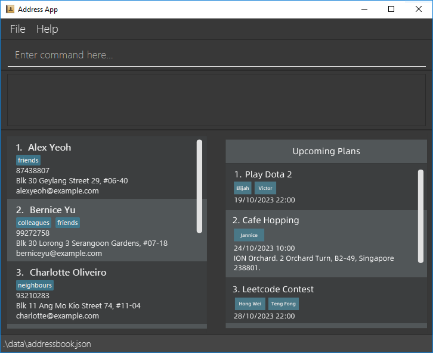

FriendBook is a GUI/CLI program made for **SoC Students** to help them keep track and manage their friends and plans.

Here's a quick summary of what FriendBook can do for you:

* All features are easily achieved using simple, typed commands!
* Reminders on how each command can be used!
* Add friends into FriendBook and keep track of their information!
* Add plans into FriendBook and keep track of them!
* Add useful information like deadlines to each of your plan!
* Associate a friend with each of your plan!

# Table of Content
- [Installation Guide](#installation-guide)
- [Disclaimers](#disclaimers)
- [Important Information](#important-information)
- [Friend-Related Features](#friend-related-features)
  - [add-friend](#add-friend)
  - [delete-friend](#delete-friend)
  - [edit-friend](#edit-friend)
  - [find-friend](#find-friend)
  - [list-friend](#list-plan)
- [Plan-Related Features](#plan-related-features)
  - [add-plan](#add-plan)
  - [delete-plan](#delete-plan)
  - [edit-plan](#edit-plan)
  - [complete-plan](#complete-plan)
  - [uncomplete-plan](#uncomplete-plan)
  - [find-plan](#find-plan)
  - [list-plan](#list-plan)
- [General Commands](#general-commands)
  - [clear](#clear)
  - [help](#help)
  - [exit](#exit)
- [Command Summary](#command-summary)
- [FAQs](#faq)

--------------------------------------------------------------------------------------------------------------------

## Installation Guide
1. Ensure you have Java 11 or above installed in your Computer. Click [here](https://blog.hubspot.com/website/check-java-verison#:~:text=First%2C%20find%20and%20click%20on,get%20your%20current%20version%20details) to learn how to find out what Java version you have!
2. You might also need to install JavaFX 11. You can find the installation guide [here](https://openjfx.io/openjfx-docs/#install-javafx). 
3. Download the latest `friendbook.jar` from here (link coming soon).
4. Open up the [terminal](https://support.apple.com/en-sg/guide/terminal/apd5265185d-f365-44cb-8b09-71a064a42125/mac) (Mac) or [command prompt](https://support.kaspersky.com/common/windows/14637#block0) (Windows).
5. Type `cd` followed by the directory path to the folder where you have downloaded FriendBook in and press `Enter`.
6. Use the command `java -jar friendbook.jar` to get the application running!
7. If you have successfully done everything, a GUI similar to the following image should appear. Please note that the application should have no data when it is used for the first time.
   

--------------------------------------------------------------------------------------------------------------------

## Disclaimers
1. Due to FriendBook being a beta release, we only support up to 10000 friends and plans.

--------------------------------------------------------------------------------------------------------------------

## Important Information

<div markdown="span" class="alert alert-info">
:information_source: The blue block highlights additional information that might be useful.
</div>

<div markdown="span" class="alert alert-danger">
:bangbang: The red block highlights disclaimers related to each command.
</div>

```
Texts in this box shows a command and it's corresponding syntax
```
- Words in `UPPER_CASE` are the parameters to be supplied by the user.
- Texts in [square brackets] indicate that the argument is optional.
- `...` indicate that more than 1 parameter of that type can be passed into the command. Otherwise, only 1 is allowed. 

### Prefixes
Prefixes allow you to specify important values when entering a command.

Here is a table of all available prefixes:

| Prefixes | Description                                                                             |
|----------|-----------------------------------------------------------------------------------------|
| `n/`     | Used to indicate the name of a Friend or Plan.                                          |
| `p/`     | Used to indicate the Phone number of a Friend.                                          |
| `e/`     | Used to indicate the Email of a Friend.                                                 |
| `a/`     | Used to indicate the Address of a Friend.                                               |
| `t/`     | Used to indicate the Tags of a Friend.                                                  |
| `d/`     | Used to indicate the start or end date of a Plan.                                       |
| `f/`     | Used to indicate the Friend associated with the Plan.|

--------------------------------------------------------------------------------------------------------------------

## Friend-Related Features

### `add-friend`

This command allows you to add a friend to your FriendBook.

```
add-friend n/NAME p/PHONE_NUMBER e/EMAIL a/ADDRESS [t/TAG]...
```

#### Examples of Correct Usage:
* `add-friend n/John Doe p/98321234 e/johnd@example.com a/Thomson Avenue t/Classmate`
* `add-friend n/Jack Ma p/92839102 e/jack.ma@yahoo.com a/Sixth Avenue`

#### Successful Output:


#### Unsuccessful Output:
- Invalid command :
  `Invalid command...`

- Non-unique person added (by their name or email) :
  `This friend already exists in the FriendBook...`

- Empty or invalid name :
  `Names should only contain alphanumeric characters and spaces, and it should not be blank...`

- Non-numeric phone number :
  `Phone numbers should only contain numbers, and it should be at least 3 digits long`

- Invalid email format :
  `Emails should be of the format local-part@domain...`

#### Disclaimer:
<div markdown="span" class="alert alert-danger">
Each friend must have a unique name and email.
</div>

<div markdown="span" class="alert alert-danger">
Friend's names are case insensitive (John and john are the same name).
</div>

<div markdown="span" class="alert alert-danger">
Friend's names can only contain alphanumeric characters and spaces. No special characters like `/` or `-` are allowed. It cannot consist of only numbers.
</div>

### `delete-friend`

This command allows you to delete a friend from your FriendBook.

```
delete-friend INDEX
```

#### Examples of Correct Usage:
* `delete-friend 1`
* `delete-friend 2`

#### Successful Output:


#### Unsuccessful Output:
- Invalid command :
  `Invalid command...`

- Missing or invalid arguments :
  `Invalid command...`

- INDEX is greater than the number of friends :
  `The friend index provided is bigger than your number of friends.`

#### Disclaimer:
<div markdown="span" class="alert alert-danger">
delete-friend command must be provided with a positive non-zero index else, an invalid command message will be shown.
</div>

<div markdown="span" class="alert alert-danger">
Friends that are associated with a Plan cannot be deleted.
</div>

### `edit-friend`

This command allows you to edit a friend's details in your FriendBook.

```
edit-friend INDEX [n/NAME] [p/PHONE] [e/EMAIL] [a/ADDRESS] [t/TAG]...
```

#### Examples of Correct Usage:
* `edit-friend 3 n/Jack Ma`
* `edit-friend 1 p/99990000`

#### Successful Output:


#### Unsuccessful Output:
- Invalid command :
  `Invalid command...`

- Missing or invalid arguments :
  `Invalid command...`

- INDEX is greater than the number of friends :
  `The friend index provided is bigger than your number of friends.`

- No optional arguments provided :
  `At least one field to edit must be provided.`

- Friend (identified by name or email) already exists :
  `This friend already exists in the FriendBook...`

#### Additional Information:
<div markdown="span" class="alert alert-info">
At least 1 optional field must be provided.
</div>

#### Disclaimer:
<div markdown="span" class="alert alert-danger">
edit-friend command must be provided with a positive non-zero index else, an invalid command message will be shown.
</div>

### `find-friend`

This command allows you to find a friend by name in your FriendBook.

```
find-friend NAME...
```

#### Examples of Correct Usage:
* `find-friend John` returns `john` and `John Doe`
* `find-friend alex david` returns `Alex Yeoh`, `David Li`

#### Successful Output:


#### Unsuccessful Output:
- Invalid command :
  `Invalid command...`

- Empty arguments :
  `Invalid syntax: Missing arguments...`

#### Additional Information:
<div markdown="span" class="alert alert-info">
The search is case-insensitive. (`hans` will match `Hans`).
</div>

<div markdown="span" class="alert alert-info">
The order of the keywords does not matter. (`Hans Bo` will match `Bo Hans`).
</div>

<div markdown="span" class="alert alert-info">
Friends matching at least one keyword will be returned.
</div>

#### Disclaimer:
<div markdown="span" class="alert alert-danger">
This search is done by name.
</div>

<div markdown="span" class="alert alert-danger">
Only full words will be matched (`Han` will not match `Hans`).
</div>

### Listing friends : `list-friend`

This command allows you to list all your friends in your FriendBook.

```
list-friend
```

#### Successful Output:


--------------------------------------------------------------------------------------------------------------------

## Plan-Related Features

### `add-plan`

This command allows you to add a plan to your FriendBook and associate an existing Friend with this plan.

```
add-plan n/PLAN_NAME d/DATE_TIME f/FRIEND_NAME
```

#### Examples of Correct Usage:
* `add-plan n/Project Meeting d/2023-10-23-10:00 f/Royden`

#### Successful Output:


#### Unsuccessful Output:
- Invalid command :
  `Invalid command...`

- Missing arguments :
  `Invalid syntax: Missing arguments...`

- Date-Time in wrong format :
  `Date-Time given is invalid. Date-Time must be in YYYY-MM-DD-HH:MM format`

- Date-Time in the past :
  `Date-Time given is invalid. Ensure that the Date-Time provided is not in the past.`

- Not a valid friend :
  `The friend does not exist in the FriendBook.`

- Empty or invalid name for Friend :
  `Names should only contain alphanumeric characters and spaces, and it should not be blank...`

#### Additional Information:
<div markdown="span" class="alert alert-info">
DATE_TIME must be in YYYY-MM-DD-HH:MM format.
</div>

<div markdown="span" class="alert alert-info">
Only 1 Friend can be associated per Plan. 
</div>

#### Disclaimer:
<div markdown="span" class="alert alert-danger">
Plans with exactly the same name, date-time and friend as an existing plan is not allowed.
</div>

<div markdown="span" class="alert alert-danger">
Plan names are case-sensitive (meeting and Meeting are different plan names).
</div>

<div markdown="span" class="alert alert-danger">
Plan names can only contain alphanumeric characters and spaces. No special characters like `/` or `-` are allowed. It cannot consist of only numbers.
</div>

### `delete-plan`

This command allows you to delete a plan from your FriendBook.

```
delete-plan INDEX
```

#### Examples of Correct Usage:
* `delete-plan 4`

#### Successful Output:


#### Unsuccessful Output:
- Invalid command :
  `Invalid command...`

- Missing or invalid arguments :
  `Invalid command...`

- INDEX is greater than the number of friends :
  `The plan index provided is bigger than your number of plans.`

#### Disclaimer:
<div markdown="span" class="alert alert-danger">
delete-plan command must be provided with a positive non-zero index else, an invalid command message will be shown.
</div>

### `edit-plan`

This command allows you to edit a plan's details in your FriendBook.

```
edit-plan INDEX [n/PLAN_NAME] [d/DATE_TIME] [f/FRIEND_NAME]
```

#### Examples of Correct Usage:
* `edit-plan 3 n/Dota 3`
* `edit-plan 1 d/2025-01-01-10:00`

#### Successful Output:


#### Unsuccessful Output:
- Invalid command :
  `Invalid command...`

- Missing or invalid arguments :
  `Invalid command...`

- INDEX is greater than the number of friends :
  `The plan index provided is bigger than your number of plans.`

- No optional arguments provided :
  `At least one field to edit must be provided.`

- Plan (identified by name, date-time and friend) already exists :
  `This plan already exists in the FriendBook.`

- Not a valid friend :
  `The friend does not exist in the FriendBook.`

#### Additional Information:
<div markdown="span" class="alert alert-info">
At least 1 optional field must be provided.
</div>

<div markdown="span" class="alert alert-info">
DATE_TIME must be in YYYY-MM-DD-HH:MM format
</div>

#### Disclaimer:
<div markdown="span" class="alert alert-danger">
edit-plan command must be provided with a positive non-zero index else, an invalid command message will be shown.
</div>

### `complete-plan`

This command allows you to mark a plan as completed in your FriendBook.

```
complete-plan INDEX
```

#### Examples of Correct Usage:
* `complete-plan 4`

#### Successful Output:


#### Unsuccessful Output:
- Invalid command :
  `Invalid command...`

- Missing or invalid arguments :
  `Invalid command...`

- INDEX is greater than the number of friends :
  `The plan index provided is bigger than your number of plans.`

#### Disclaimer:
<div markdown="span" class="alert alert-danger">
complete-plan command must be provided with a positive non-zero index else, an invalid command message will be shown.
</div>

### uncomplete-plan

This command allows you to unmark a plan's completion status in your FriendBook.

```
uncomplete-plan INDEX
```

#### Examples of Correct Usage:
* `uncomplete-plan 4`

#### Successful Output:


#### Unsuccessful Output:
- Invalid command :
  `Invalid command...`

- Missing or invalid arguments :
  `Invalid command...`

- INDEX is greater than the number of friends :
  `The plan index provided is bigger than your number of plans.`

#### Disclaimer:
<div markdown="span" class="alert alert-danger">
uncomplete-plan command must be provided with a positive non-zero index else, an invalid command message will be shown.
</div>

### `find-plan`

This command allows you to find a plan by name in your FriendBook.

```
find-plan FRIEND_NAME
```

#### Examples of Correct Usage:
* `find-plan John` returns all plans associated to `John`

#### Successful Output:


#### Unsuccessful Output:
- Invalid command :
  `Invalid command...`

- Missing or invalid arguments :
  `Invalid command...`

- Not a valid friend :
  `The friend does not exist in the FriendBook.`

#### Additional Information
<div markdown="span" class="alert alert-info">
The search is case-insensitive (`hans` will match `Hans`).
</div>

#### Disclaimers
<div markdown="span" class="alert alert-danger">
`FRIEND_NAME` must be the full name of a friend in the FriendBook.
</div>

<div markdown="span" class="alert alert-danger">
Only one full name should be provided.
</div>

### `list-plan`

This command allows you to list all your plans in your FriendBook.

```
list-plan
```

#### Successful Output:


## General Commands

### `clear`
This command clears the stored friends and plans on the `friendbook.json` file which is located in the `data` folder in FriendBook's home folder.

### `help`
This command provides the FriendBook user guide's link.

### `exit`
This command closes the FriendBook application.

--------------------------------------------------------------------------------------------------------------------

## FAQ

**Q**: How do I transfer my data to another Computer?<br>
**A**: Install the app in the other computer and overwrite the empty data file it creates with the file that contains the data of your previous FriendBook home folder.

--------------------------------------------------------------------------------------------------------------------

## Known issues

1. **When using multiple screens**, if you move the application to a secondary screen, and later switch to using only the primary screen, the GUI will open off-screen. The remedy is to delete the `preferences.json` file created by the application before running the application again.

--------------------------------------------------------------------------------------------------------------------

## Command Summary

Action | Format, Examples
--------|------------------
**add-friend** | `add-friend n/NAME p/PHONE_NUMBER e/EMAIL [t/TAG]...` <br> e.g., `add-friend n/John Doe p/98321234 e/johnd@example.com`
**edit-friend** | `edit-friend INDEX [n/NAME] [p/PHONE] [e/EMAIL] [t/TAG]...`<br> e.g., `edit-friend 3 n/Jack Ma`
**delete-friend** | `delete-friend NAME` <br> e.g., `delete-friend John Doe`
**find-friend** | `find-friend KEYWORD [MORE_KEYWORDS]`<br> e.g., `find-friend Jack`
**list-friend** | `list-friend`
**add-plan** | `add-plan n/PLAN_NAME d/DATE_TIME f/FRIEND_NAME`<br> e.g.,`add-plan n/Project Meeting d/2023-10-23-10:00 f/Royden`
**edit-plan** | `edit-plan INDEX [n/PLAN_NAME] [d/DATE_TIME] [f/FRIEND_NAME]`<br> e.g., `edit-plan 1 d/2025-01-01-10:00`
**complete-plan** | `complete-plan INDEX`<br> e.g., `complete-plan 4`
**uncomplete-plan** | `uncomplete-plan INDEX`<br> e.g., `uncomplete-plan 4`
**delete-plan** | `delete-plan INDEX` <br> e.g., `delete-plan 4`
**find-plan** | `find-plan FRIEND_NAME` <br> e.g., `find-plan John`
**list-plan** | `list-plan`
